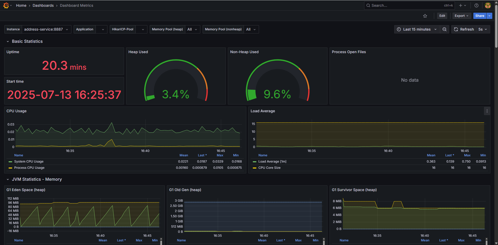
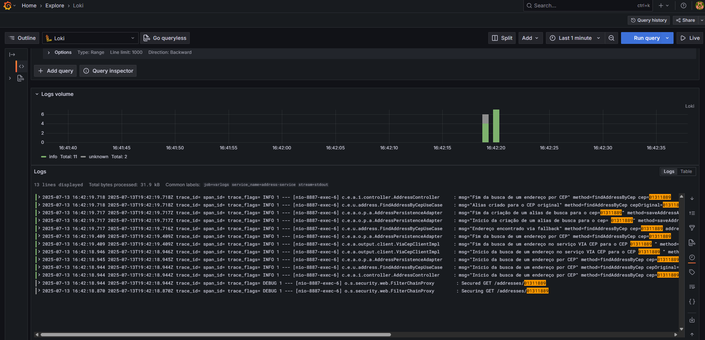
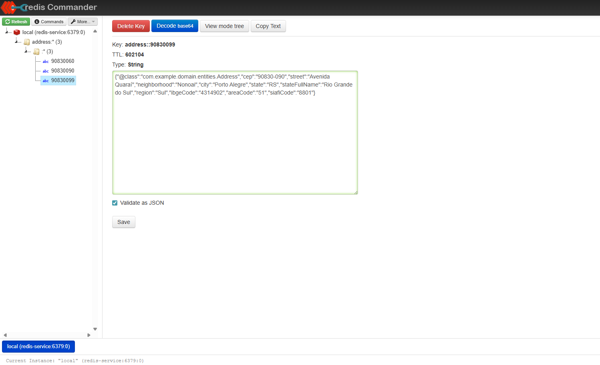

<h1 align="center">
📍Address Service<br>
</h1>

[](https://github.com/RodrigoAntonioCruz/address-service/actions/workflows/build.yml)  [](https://codecov.io/gh/RodrigoAntonioCruz/address-service)

**Address Service** é um microserviço Java Spring Boot responsável por consultar, armazenar e disponibilizar informações de endereços através do CEP.


## 🏛️ Arquitetura

A arquitetura do serviço é baseada em uma abordagem de microsserviços, com foco em desempenho, cache e observabilidade. Além disso, o projeto foi desenvolvido seguindo os princípios da **Clean Architecture**, garantindo separação clara de responsabilidades e facilitando a manutenção, evolução e testabilidade do código.

Toda a solução está organizada em uma estrutura multi-módulos (modular), permitindo maior isolamento entre as camadas do sistema, independência entre domínios e melhor reaproveitamento de código. Essa estratégia facilita tanto a execução de testes unitários e integrados quanto a gestão das dependências, além de reduzir o acoplamento entre os diferentes componentes da aplicação.

Veja o diagrama abaixo para visualizar a organização da solução:


Mais detalhes das decisões técnicas podem ser encontrados na [ADR-001 - Arquitetura do Address Service](docs/adr/ADR-001-architecture-address-service.md).


## 🛠️ Stacks

- **Java 17**
- **Spring Boot 3**
    - Spring Security
    - Spring Cloud (Feign, Circuit Breaker com Resilience4j)
    - Spring Data Redis
    - Spring Data MongoDB
- **Lombok**
- **Jackson** (Serialização JSON)
- **Redis** (Cache)
- **MongoDB** (Persistência NoSQL)
- **Swagger / OpenAPI** (Documentação de API)
- **Observabilidade**
    - Prometheus & Grafana (Métricas)
    - Loki & Grafana (Logs)
- **Testes**
    - JUnit
    - Mockito


## 🚀 Como Iniciar

### 📋 Requisitos

Para rodar esta aplicação, você deve ter instalado em seu computador:

- [Docker](https://docs.docker.com/get-started/)

- [Docker Compose](https://docs.docker.com/compose/)


### ▶️ Executando o Projeto

1. Clone ou baixe o projeto do repositório para o seu computador.

2. Navegue até a raiz do diretório do projeto e execute o seguinte comando no terminal:

    ```bash
    docker compose up -d
    ```

3. Após a execução do comando acima, você verá uma tela semelhante à seguinte, com os containers criados e em execução:

   

4. Após os containers estarem ativos, acesse a documentação <a href="http://localhost:8887/v1/api/swagger-ui/index.html" target="_blank" title="Clique e navegue!">Swagger</a> no navegador para testar os endpoints disponíveis:

<a href="http://localhost:8887/v1/api/swagger-ui/index.html" target="_blank" title="Swagger">


</a>

5. Após acessar o endpoint de cadastro no <a href="http://localhost:8887/v1/api/swagger-ui/index.html#/Cadastro%20de%20Usu%C3%A1rio/signUp" target="_blank" title="Clique e navegue!">Swagger</a> e criar um novo usuário, autentique-se e faça buscas de CEPs variados. Você poderá acompanhar as métricas no <a href="http://localhost:3000" target="_blank" title="Clique para acessar o Grafana!">Grafana</a>.


## 🔎 Observabilidade

### Métricas com Grafana & Prometheus

<a href="http://localhost:3000/d/sOae4vCnk/dashboard-metrics?orgId=1&from=now-5m&to=now&timezone=browser&var-instance=address-service:8887&var-application=&var-memory_pool_heap=$__all&var-memory_pool_nonheap=$__all&refresh=5s" target="_blank" title="Clique para acessar o Grafana!">



</a>


### Logs com Grafana & Loki

<a href="http://localhost:3000/explore?schemaVersion=1&panes=%7B%225gl%22%3A%7B%22datasource%22%3A%22loki%22%2C%22queries%22%3A%5B%7B%22refId%22%3A%22A%22%2C%22expr%22%3A%22%22%2C%22queryType%22%3A%22range%22%2C%22datasource%22%3A%7B%22type%22%3A%22loki%22%2C%22uid%22%3A%22loki%22%7D%2C%22editorMode%22%3A%22builder%22%2C%22direction%22%3A%22backward%22%7D%5D%2C%22range%22%3A%7B%22from%22%3A%22now-1h%22%2C%22to%22%3A%22now%22%7D%7D%7D&orgId=1" target="_blank" title="Clique para acessar o Grafana!">



</a>

[Credenciais do Dashboard do Grafana aqui](docs/adr/credentials-grafana.md)

### Redis Commander

Caso queira acompanhar os dados armazenados no Redis, basta acessar a interface visual do Redis Commander em <a href="http://localhost:8081/" target="_blank" title="Clique para acessar o Redis Commander!">Redis Commander</a>.

<a href="http://localhost:8081/" target="_blank" title="Clique para acessar o Redis Commander!"> 



</a>

[Credenciais do Redis Commander aqui](docs/adr/credentials-redis.md)