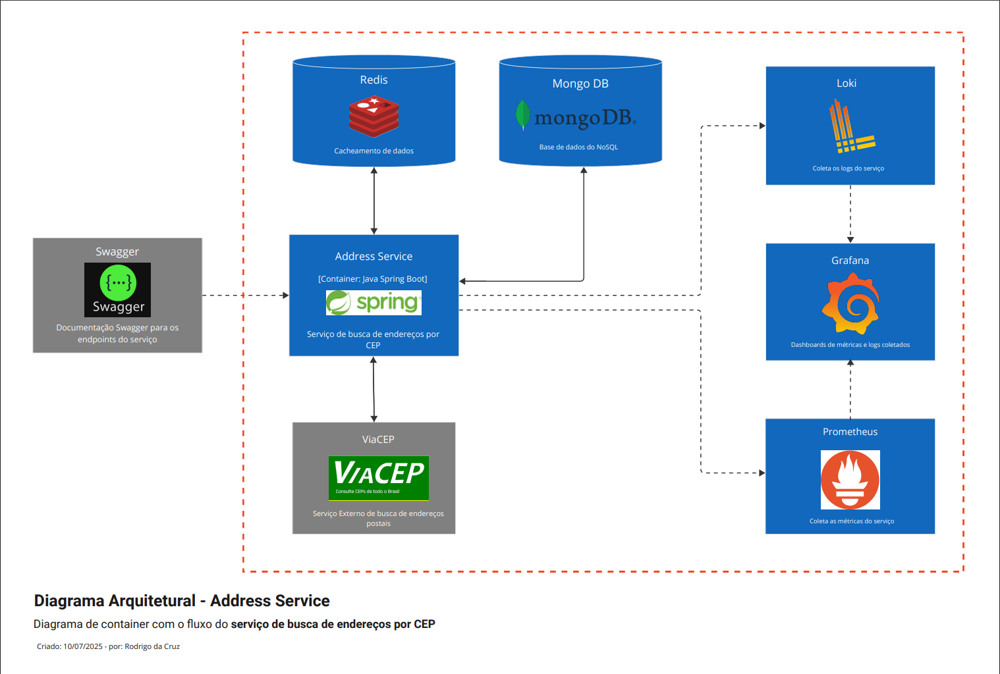

<h1 style="text-align: center;">📍 Address Service</h1>

**Address Service** é um microserviço Java Spring Boot responsável por consultar, armazenar e disponibilizar informações de endereços através do CEP.

## 🏛️ Arquitetura

A arquitetura do serviço é baseada em uma abordagem de microsserviços, com foco em desempenho, cache e observabilidade. Além disso, o projeto foi desenvolvido seguindo os princípios da **Clean Architecture**, garantindo separação clara de responsabilidades e facilitando a manutenção, evolução e testabilidade do código.

Toda a solução está organizada em uma estrutura multi-módulos (modular), permitindo maior isolamento entre as camadas do sistema, independência entre domínios e melhor reaproveitamento de código. Essa estratégia facilita tanto a execução de testes unitários e integrados quanto a gestão das dependências, além de reduzir o acoplamento entre os diferentes componentes da aplicação.

Veja o diagrama abaixo para visualizar a organização da solução:



Mais detalhes das decisões técnicas podem ser encontradas na [ADR-001 - Arquitetura do Address Service](docs/adr/ADR-001-architecture-address-service.md).

## 🛠️ Stacks

- **Java 17**
- **Spring Boot 3**
  - Spring Security
  - Spring Cloud (Feign, Circuit Breaker com Resilience4j)
  - Spring Data Redis
  - Spring Data MongoDB
- **Lombok**
- **Jackson** (Serialização JSON)
- **Redis** (Cache)
- **MongoDB** (Persistência NoSQL)
- **Swagger / OpenAPI** (Documentação de API)
- **Observabilidade**
  - Prometheus & Grafana (Métricas)
  - Loki & Grafana (Logs)
- **Testes**
  - JUnit
  - Mockito

## 🚀 Como Iniciar

### 📋 Requisitos

Para rodar esta aplicação, você deve ter instalado em seu computador:

- [Docker](https://docs.docker.com/get-started/)
- [Docker Compose](https://docs.docker.com/compose/)

### ▶️ Executando o Projeto

1. Clone ou baixe o projeto do repositório para o seu computador.

2. Navegue até a raiz do diretório do projeto e execute o seguinte comando no terminal:

    ```bash
    docker-compose up -d
    ```

3. Após a execução do comando acima, você verá uma tela semelhante à seguinte, com os containers criados e em execução:

   

4. Após os containers estarem ativos, estarão disponíveis para acesso em seu browser os seguintes `endpoints` para teste:

    <a href="http://localhost:8887/v1/api/swagger-ui/index.html" target="_blank" title="Clique e navegue!">

   

    </a>
